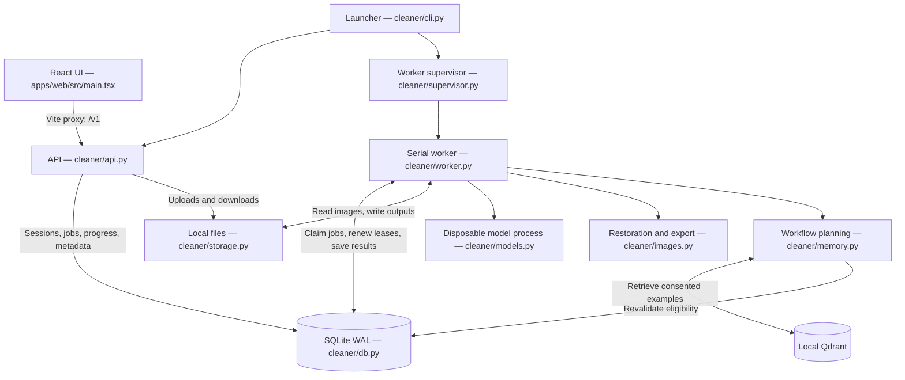
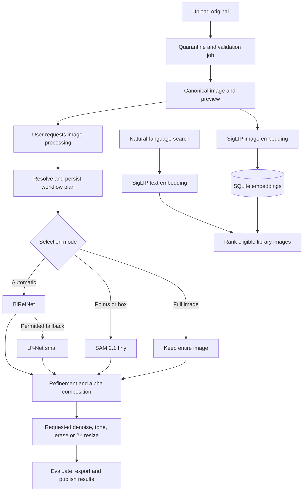

# Code map

The development UI runs in Vite on port 5173. Vite forwards `/v1` requests to FastAPI on port 8000. Python runs from `.runtime`; no frontend build is needed.

The API validates sessions, ownership, Origin and CSRF before accepting work. SQLite is also the durable queue: the API records jobs and the worker claims them. Leases and fencing prevent an old worker attempt from publishing results after it loses ownership. Progress is stored in SQLite and delivered through the API using SSE or polling.

The supervisor restarts a crashed worker. The worker runs one job at a time and starts disposable subprocesses for decoding or inference. Model subprocesses have network access disabled and are stopped on cancellation, deadlines or resource pressure.

Library search uses SigLIP and SQLite embeddings. Qdrant serves a different purpose: retrieving eligible workflow examples. Retrieved examples are rechecked against SQLite for consent, revocation and approved recipes; unavailable retrieval falls back to baseline processing. Quality qualification and calibrated workflow improvements remain incomplete; see `verification.md`.

| File | Responsibility |
|---|---|
| `apps/web/src/main.tsx` | Library, search, canvas, restoration controls, progress and downloads |
| `cleaner/api.py` | HTTP contracts, authentication, uploads and job requests |
| `cleaner/domain.py` | Typed requests, mask roles, limits and errors |
| `cleaner/db.py` | Durable state, job claims, leases, events and transactions |
| `cleaner/worker.py` | Execute stages and publish results safely |
| `cleaner/models.py` | Verified local model adapters |
| `cleaner/images.py` | Decode, transforms, measurements, composition, restoration and export |
| `cleaner/memory.py`, `cleaner/workflows.py` | Retrieval, consent checks and deterministic workflow selection |
| `cleaner/storage.py` | Filesystem paths and atomic writes |
| `cleaner/lifecycle.py` | Deletion, retention, backup and restore replay |
| `cleaner/provision.py` | Explicit model installation and verification |
